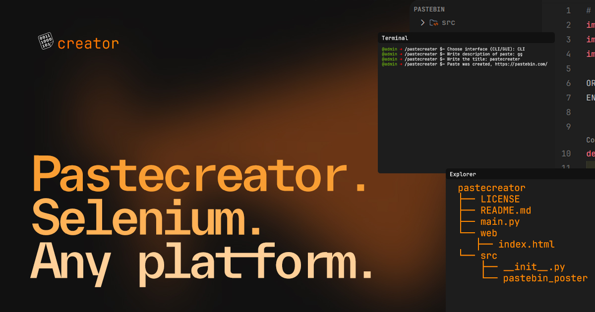

<p align="center">
  <a href="https://github.com/xdearboy/pastecreator/graphs/contributors">
    
  </a>
  <a href="https://github.com/xdearboy/pastecreator/network/members">
    
  </a>
  <a href="https://github.com/xdearboy/pastecreator/stargazers">
    
  </a>
  <a href="https://github.com/xdearboy/pastecreator/issues">
    
  </a>
  <a href="https://github.com/xdearboy/pastecreator/blob/master/LICENSE.txt">
    
  </a>
</p>


<!-- PROJECT LOGO -->
<br />
<div align="center">
  <a href="https://github.com/xdearboy/pastecreator">
    
  </a>

  <h3 align="center">pastecreator</h3>

  <p align="center">
    <p align="center">
    Convenient application in two views - CLI/GUI, which automates uploading a paste to Pastebin.
    <br />
    <br />
    <a href="https://small.fileditchstuff.me/s11/VUQRPxHbDPTvlIBkPzzT.gif">View Demo</a>
    ·
    <a href="https://github.com/xdearboy/pastecreator/issues/new?labels=bug&template=bug-report---.md">Report Bug</a>
    ·
    <a href="https://github.com/xdearboy/pastecreator/issues/new?labels=enhancement&template=feature-request---.md">Request Feature</a>
  </p>
</div>

--------------------------------------

### Prerequisites

Before you begin, ensure you have met the following requirements:

* You have installed the latest version of `python/pastecreator`
* You have a `Windows/Linux/Mac` machine.

--------------------------------------

### Installation

1. **Clone the repository**

   ```sh
   git clone https://github.com/xdearboy/pastecreator.git
   ```

2. **Install the dependencies**

   ```sh
   pip3 install -r requirements.txt
   ```

3. **Run the application**

   ```sh
   python3 main.py
   ```

--------------------------------------

### Demo


--------------------------------------

### Contributing

Contributions are **welcome** and will be fully **credited**.

You can contribute in many ways:

* By using alpha, beta, and pre-releases
* By reporting bugs
* By suggesting new features
* By fixing issues
* By reviewing pull requests

We use [Github Flow](https://guides.github.com/introduction/flow/index.html),
so fork the repo and create your branch from `master`.

--------------------------------------

### Authors

* [xdearboy](https://github.com/xdearboy)

--------------------------------------


